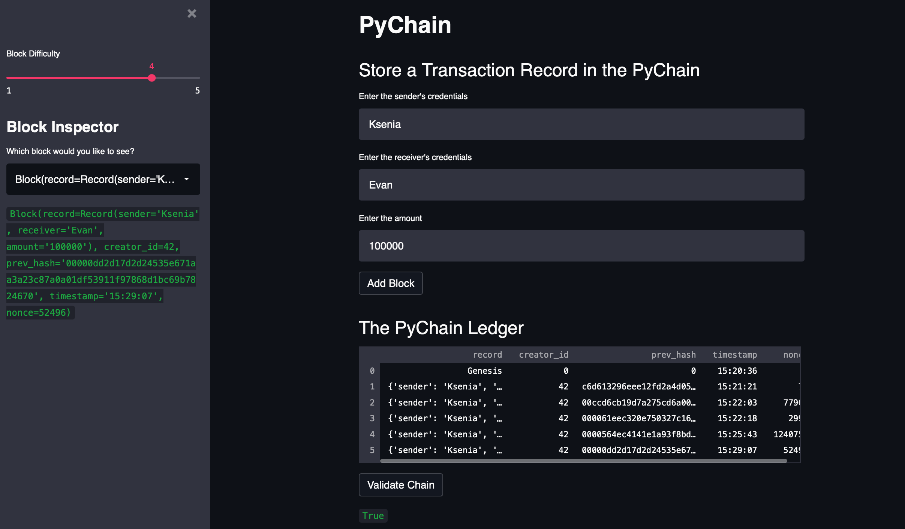

# Blockchain based distributed ledger
The aim of this project was to build a blockchain-based ledger system, completed with a user-friendly web interface. This ledger allows parties to conduct financial transactions (that is, to transfer money between senders and receivers) and to verify the integrity of the data in the ledger. Moreover, the application contains a slider that allows to control the difficulty value for the 'proof of work' method.

---

## Technology
* Streamlit - a Python library that allows developers to quickly build web interfaces fro applications using Python script

To install the above library run the following command in your terminal:
``` python
pip install streamlit 
```
* Hashlib - Python hashlib module is an interface for hashing messages easily. This contains numerous methods which will handle hashing any raw message in an encrypted format. The core purpose of this module is to use a hash function on a string, and encrypt it so that it is very difficult to decrypt it.

* Pandas - to showcase the transactions in a DataFrame

---

## Required libraries and dependencies 

``` python
import streamlit as st
from dataclasses import dataclass
from typing import Any, List
import datetime as datetime
import pandas as pd
import hashlib
```

---

## Usage 

To run the app, simply clone tihs github repository to your machine. Navigate to the directory that contains the 'pychain.py' file and run the following command:

```python
streamlit run pychain.py
```

The graphic below showcases a blockchain that consists of multiple blocks and indicates the validity of the blockchain.




For a better overview of how this application works, refer to the video recording pushed to this repo.

 ---

## Contributors
Brought to you by Ksenia Gorska
  kseniagorska@icloud.com 

[My linkedin profile](https://www.linkedin.com/in/ksenia-gorska/)

---

## License

MIT
